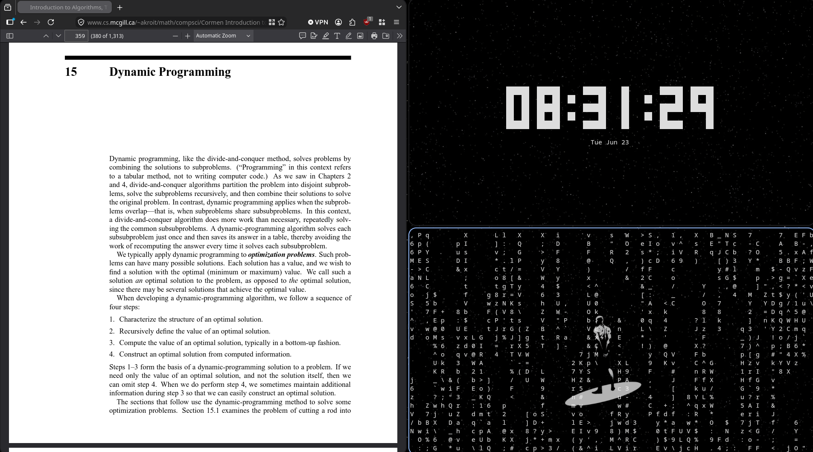
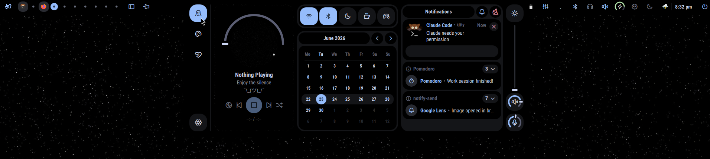

# linux-setup

My CachyOS (Arch-based) desktop setup. Managed with
[GNU Stow](https://www.gnu.org/software/stow/): every file under `home/` mirrors
its real location under `$HOME` and gets symlinked there.

> Tuned for one machine: an ASUS laptop with a hybrid **AMD iGPU + NVIDIA RTX
> 4070**, multi-monitor, username `nethum`. The Hyprland and Ambxst configs hard-code
> hardware details — read before applying to different hardware.

## Screenshots

Hyprland tiling a Firefox window alongside a clock + `cmatrix` column:



The Ambxst bar and control center — quick toggles, media, calendar, notifications:



## Layout

```
home/                       # stow package → symlinked into ~
  .config/
    hypr/       hyprland.conf        # sources generated gpu.conf (see below)
                monitors.conf  workspaces.conf  monitors.lua   # nwg-displays owns these
    ambxst/     binds.json + per-feature config (bar, dock, theme, …)
    handy-voice/  config.toml + env  # wake-word daemon config (docs/voice.md)
    systemd/user/ agentdash.service  # usage-indicator daemon (docs/usage-indicator.md)
    fish/       config.fish + functions
    kitty/  ghostty/  alacritty/      # terminals
    btop/  cava/  hyprshell/        # TUIs / shell extras
    autostart/  solaar.desktop        # Logitech (MX Master) daemon
  .peaclock/    config
  .local/bin/   lidawake  keybinds  pomodoro  tbinds  usage
tools/
  agentdash/                          # vendored usage indicator (no upstream)
  gen-gpu-conf.sh                     # detects GPUs → writes gpu.conf + udev rule
docs/
  apps.md                             # curated installed-software inventory
  hardware.md                         # GPU matrix + per-machine assumptions
  packages-explicit.txt               # pacman -Qqe snapshot (ground truth)
  tailscale.md                        # tailnet shape + the CachyOS MagicDNS fix
  voice.md  usage-indicator.md        # the voice stack + usage indicator
packages.txt                          # core stack for pacman --needed
install.sh                            # one-shot: packages + stow + udev + repos + services
```

## Install

```sh
git clone https://github.com/nethum529/linux-setup ~/linux-setup
cd ~/linux-setup
./install.sh            # or ./install.sh --no-pkgs to skip pacman
```

One shot: installs the core packages (`packages.txt`), stows the dotfiles,
installs the udev rule, deploys the vendored agentdash + its user service,
clones tool-ring and handy-voice-activation and runs their installers, then
prints the few remaining manual steps (Handy AppImage, Claude Code login).

## The multi-GPU fix (the interesting part)

On a hybrid iGPU+NVIDIA laptop, Hyprland's allocator must open the **iGPU**
first or it crashes on launch with *"no allocator available"*. The catch:
Aquamarine splits `AQ_DRM_DEVICES` on `:`, and PCI by-path names contain colons,
so they get shredded. The fix is colon-free, rename-stable DRM symlinks from a
generated udev rule, then:

```
env = AQ_DRM_DEVICES,/dev/dri/igpu-card:/dev/dri/nv-card
```

All of this is machine-specific, so `tools/gen-gpu-conf.sh` detects the GPU
topology and generates both the udev rule (real PCI addresses) and
`~/.config/hypr/gpu.conf` — hybrid, NVIDIA-only (RTX 50 series included), and
AMD/Intel-only boxes each get the right env. Matrix and reasoning:
[docs/hardware.md](docs/hardware.md).

## Voice activation and usage indicator

- **Voice**: the Handy speech-to-text app plus the
  [handy-voice-activation](https://github.com/nethum529/handy-voice-activation)
  wake-word daemon ("mars" toggles recording hands-free). Config is stowed from
  `home/.config/handy-voice/`; details in [docs/voice.md](docs/voice.md).
- **Usage indicator**: `tools/agentdash` tracks Claude Code + Codex rate-limit
  windows; the `usage` CLI and `agentdash.service` daemon expose it. Details in
  [docs/usage-indicator.md](docs/usage-indicator.md).

## Companion repos

- **[tool-ring](https://github.com/nethum529/tool-ring)** — the radial launcher ring
  bound to `Super+G`.
- **[handy-voice-activation](https://github.com/nethum529/handy-voice-activation)** —
  the wake-word daemon; its installer is run by `install.sh`.

## Scripts

| script     | what it does                                           |
|------------|--------------------------------------------------------|
| `lidawake` | toggle "close lid, stay awake" via a logind inhibitor  |
| `keybinds` | pretty-printed Hyprland keybind cheat sheet            |
| `pomodoro` | zero-dependency peaclock-style Pomodoro TUI            |
| `tbinds`   | tmux keybind cheat sheet                               |
| `usage`    | Claude Code + Codex rate-limit usage (agentdash CLI)   |
